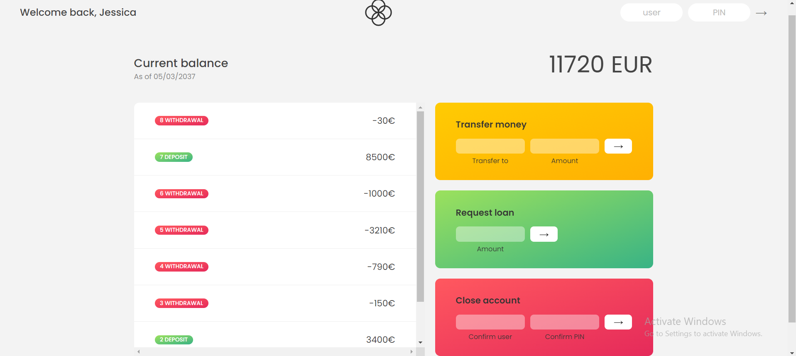
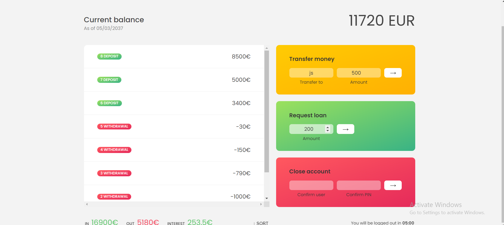

# Bankist-App
A  possible real bank application model. 
One of my dearest projects of all and also the most complex one. From the DOM manipulation and elements creating using JavaScript, to Transfer money between accounts, Request loan, Display Balance and other account summary, to Close the account. 
I've also implemented the LOGIN process, try using Username: js and PIN: 1111 to go to your bank account. 
Try transfer money to account js. You can login to this account to check the deposit using Username: jd,  PIN 2222. 
You can SORT the movements in an ascending order. 
The summary contains the deposits (IN), withdrawals (OUT) and INTEREST (the amount of money bank offers for your deposits). 

Future improvments: I am curently working on implementing the time counting for how much you can stay loged in. 

Here are some SCREENSHOTS to see features of my project and my code: 

